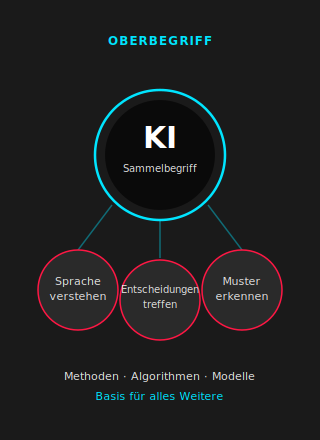
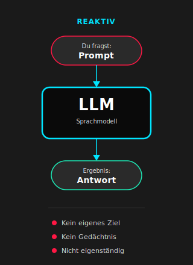
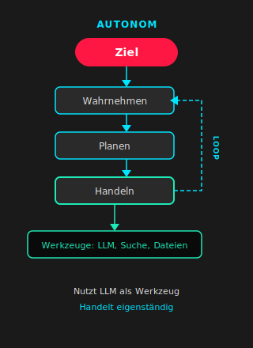
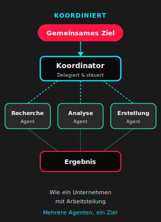
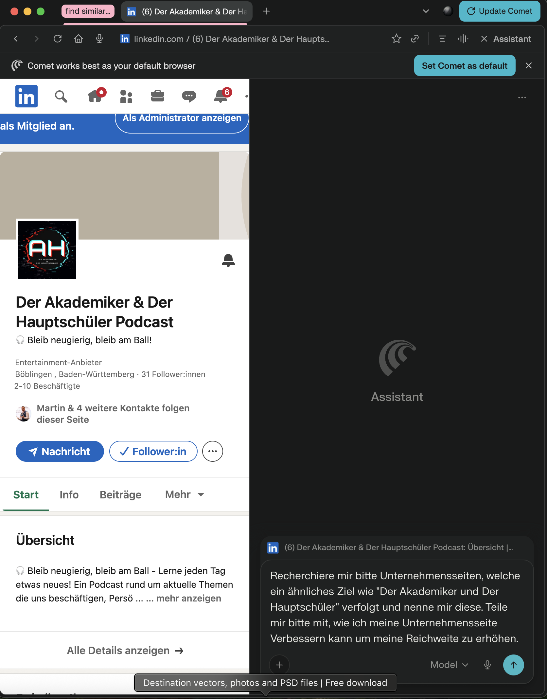
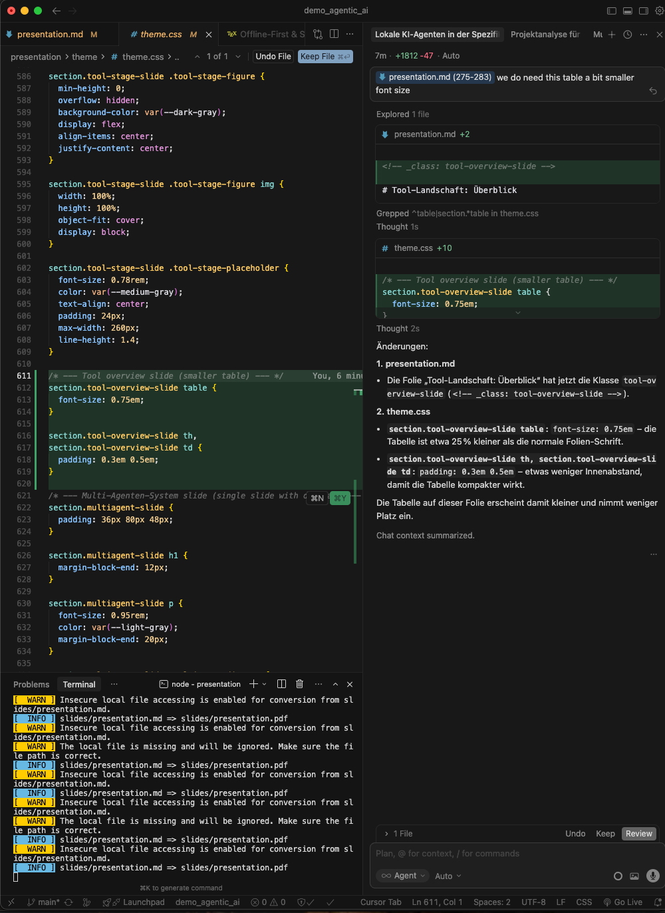
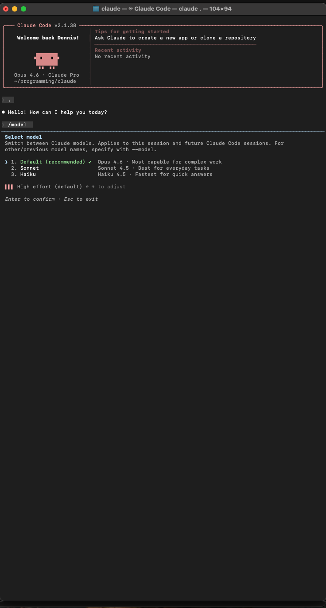
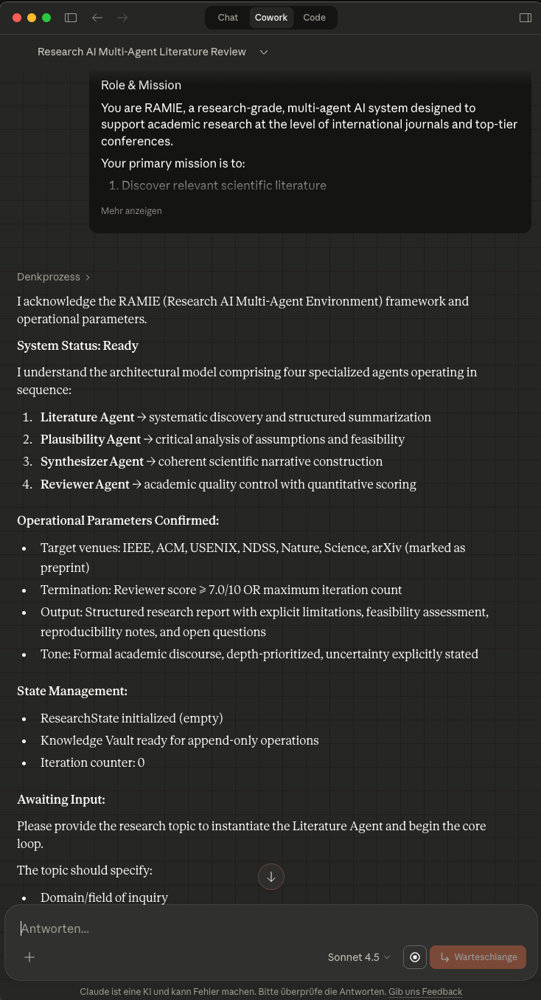
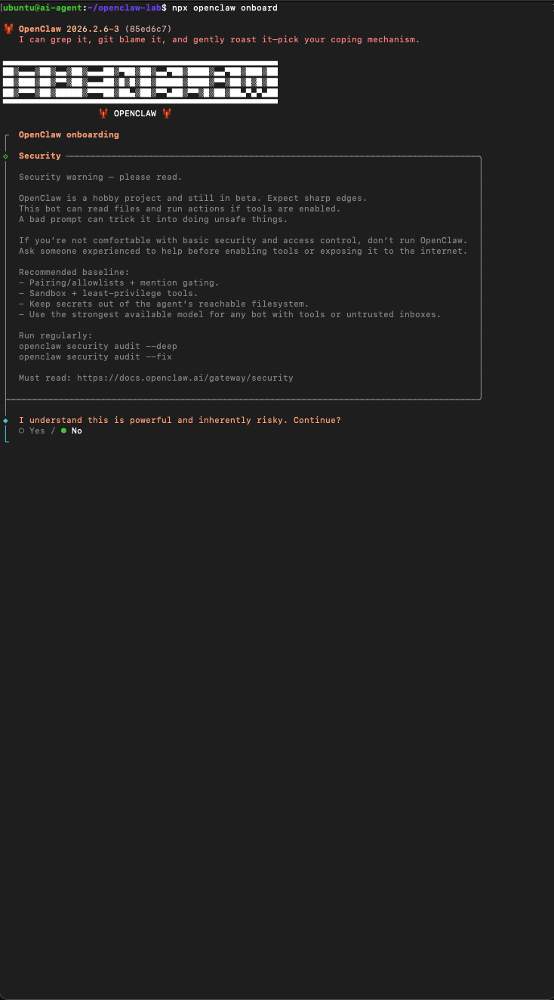

<!-- _class: title-slide -->

# Deep Dive: Agentische KI
## Vom Chatbot zum digitalen Team

**Dennis Grewe · Martin Jäger**  
*Der Akademiker und der Hauptschüler*

---

<!-- _class: agenda-slide -->

<h1 class="agenda-main-title">Agenda</h1>

  

    01
    

    <h3 class="agenda-item-title">Ziel & Leitidee</h3>
    
Für wen diese Session gedacht ist und welcher rote Faden uns leitet

  

  

    02
    

    <h3 class="agenda-item-title">Einordnung & Konzepte</h3>
    
Von klassischer KI über LLMs zu Agenten und agentischen Systemen

  

  

    03
    

    <h3 class="agenda-item-title">Tool-Landschaft</h3>
    
Browser, IDE, CLI bis OpenClaw – Autonomie und Risiken im Überblick

  

  

    04
    

    <h3 class="agenda-item-title">KI als Mitarbeiter</h3>
    
Praktisches Beispiel: Social Media Management durch Agenten

  

  

    05
    

    <h3 class="agenda-item-title">Live-Demo</h3>
    
Geschäftsreiseplanung mit Multi-Agenten-System und technischem Walkthrough

  

  

    06
    

    <h3 class="agenda-item-title">Risiken & Chancen</h3>
    
Zusammenfassung der Risiken und Ausblick auf die Zukunft

  

---

<!-- _class: goal-slide -->

  <h1 class="goal-slide-title">Ziele</h1>
  
Konzept der <strong>agentischen KI</strong> verständlich und erlebbar machen.

  

  

    

      01
      

      
Personen am Anfang ihres KI Abenteuers

    

    

      02
      

      
Führungskräfte und Entscheidungsträger:innen ohne tiefen technischen Hintergrund

    

  

  

---

<!-- _class: roadmap-slide -->

  <h1 class="roadmap-slide-title">Leitidee</h1>
  <blockquote class="roadmap-quote">Agentische KI ist <strong>kein besserer Chatbot</strong> – sondern ein <strong>digitales Team</strong> mit Rollen, Aufgaben und Verantwortung.</blockquote>
  
Wir schauen uns auf der Karte an:

  

    
<strong>Einordnung</strong> – Von klassischer KI über LLMs zu Agenten und agentischen Systemen.

    
<strong>Tool-Landschaft</strong> – Wo kann ich welches Tool nutzen und welche Risiken gibt es?

    
<strong>KI als Mitarbeiter</strong> – Vom Konzept zum praktischen Einsatz im Alltag.

    
<strong>Live-Demo</strong> – Multi-Agenten-System in Aktion erleben.

    
<strong>Risiken &amp; Ausblick</strong> – Leitplanken setzen und Zukunft einordnen.

  

  

---

<!-- _class: section-slide section-slide-einordnung section-slide-demo-bright -->

  <h1 class="section-slide-title">Einordnung</h1>
  
KI, LLM, Agenten, etc.

---

<!-- _class: einordnung-road-slide -->

# Einordnung: Von KI zu agentischen Systemen

  

    

      <!-- Brain icon -->
      <svg class="einordnung-icon" viewBox="0 0 24 24" aria-hidden="true">
        <path fill="currentColor" d="M12 4c-2.2 0-4 1.8-4 4 0 1 .4 2 1 2.7-.8.5-1.3 1.4-1.3 2.4 0 1.5 1.2 2.8 2.7 2.8.4 0 .8-.1 1.2-.2-.1.5-.1 1 0 1.5.4 1.3 1.5 2.2 2.8 2.2 1.6 0 2.9-1.3 2.9-2.9 0-.6-.2-1.2-.5-1.7.8-.5 1.4-1.3 1.4-2.2 0-1.2-.6-2.2-1.6-2.7.5-.8.8-1.8.8-2.8 0-2.2-1.8-4-4-4z"/>
      </svg>
    

    

      
Künstliche Intelligenz

      
Basisfähigkeiten (Methoden, Algorithmen)

    

  

  

    

      <!-- Text file icon -->
      <svg class="einordnung-icon" viewBox="0 0 24 24" aria-hidden="true">
        <path fill="currentColor" d="M6 2h12a2 2 0 0 1 2 2v16a2 2 0 0 1-2 2H6a2 2 0 0 1-2-2V4a2 2 0 0 1 2-2zm0 2v16h12V4H6zm2 2h8v2H8V6zm0 4h8v2H8v-2zm0 4h5v2H8v-2z"/>
      </svg>
    

    

      
Large Language Models

      
Sprachmodelle (textbasierte KI)

    

  

  

    

      <!-- Robot icon -->
      <svg class="einordnung-icon" viewBox="0 0 24 24" aria-hidden="true">
        <path fill="currentColor" d="M12 2a3 3 0 0 1 3 3v2h1a3 3 0 0 1 3 3v10a3 3 0 0 1-3 3H9a3 3 0 0 1-3-3V10a3 3 0 0 1 3-3h1V5a3 3 0 0 1 3-3zm0 2a1 1 0 0 0-1 1v2h2V5a1 1 0 0 0-1-1zm-2 5a1 1 0 0 0-1 1v8a1 1 0 0 0 1 1h6a1 1 0 0 0 1-1v-8a1 1 0 0 0-1-1h-6zm1 2h4v5h-4V9zm0 6h4v1h-4v-1z"/>
        <circle cx="9" cy="8" r="1.2" fill="currentColor"/>
        <circle cx="15" cy="8" r="1.2" fill="currentColor"/>
      </svg>
    

    

      
Agent

      
Interaktive Systeme (Assistenten)

    

  

  

    

      <!-- Human employee icon -->
      <svg class="einordnung-icon" viewBox="0 0 24 24" aria-hidden="true">
        <path fill="currentColor" d="M12 2c-2.2 0-4 1.8-4 4 0 1.2.5 2.3 1.4 3.1C7.8 9.5 7 11 7 12.5V15h2v-2.5c0-1.1.9-2 2-2s2 .9 2 2V15h2v-2.5c0-1.5-.8-3-2.4-3.4C15.5 8.3 16 7.2 16 6c0-2.2-1.8-4-4-4zm0 2a2 2 0 0 1 2 2c0 .6-.3 1.2-.7 1.6l-.3.2V8h-2v.2l-.3-.2C10.3 7.2 10 6.6 10 6a2 2 0 0 1 2-2z"/>
        <path d="M12 18v4M10 20h4" stroke="currentColor" stroke-width="0.8" fill="none"/>
        <path fill="currentColor" d="M8 14h2v4H8zm6 0h2v4h-2z"/>
      </svg>
    

    

      
Agentische KI

      
Autonome Agenten (Teams)

    

  

  
Entwicklung

  

---

<!-- _class: concept-slide -->

  <h1 class="concept-slide-title">Künstliche Intelligenz (KI)</h1>
  
<strong>KI</strong> ist ein Sammelbegriff für Systeme, die Aufgaben übernehmen, für die normalerweise <strong>menschliche Intelligenz</strong> benötigt wird.

  
Beispiele

  <ul class="concept-slide-list">
    <li>Sprache verstehen</li>
    <li>Entscheidungen treffen</li>
    <li>Muster erkennen</li>
  </ul>
  
<strong>Einordnung:</strong> Basis für alles Weitere – KI als Oberbegriff, LLMs und Agenten als konkrete Ausprägungen.

  

---

<!-- _class: concept-slide -->

  <h1 class="concept-slide-title">Large Language Models (LLMs)</h1>
  
Ein <strong>LLM</strong> ist ein KI-System, das Sprache sehr gut versteht und erzeugt.

  
Wichtige Eigenschaften

  <ul class="concept-slide-list">
    <li>Reagiert auf Eingaben</li>
    <li>Hat <strong>kein</strong> eigenes Ziel</li>
    <li>Handelt <strong>nicht</strong> selbstständig</li>
    <li>Besitzt kein dauerhaftes Gedächtnis</li>
  </ul>
  
<strong>Analogie:</strong> Ein sehr gut ausgebildeter Praktikant – liefert top Ergebnisse, aber nur wenn man ihn direkt anspricht. Ohne Anweisung passiert nichts.

  

---

<!-- _class: concept-slide -->

  <h1 class="concept-slide-title">Agent</h1>
  
Ein <strong>Agent</strong> ist ein System, das ein Ziel verfolgt, Entscheidungen trifft, eigenständig handelt und Werkzeuge nutzt – z. B. LLMs, Suche, Dateien.

  
Ein Agent <strong>nutzt</strong> ein LLM – er <strong>ist</strong> kein LLM.

  
Kernmerkmale

  <ul class="concept-slide-list">
    <li>Verfolgt ein Ziel</li>
    <li>Trifft Entscheidungen</li>
    <li>Handelt eigenständig</li>
    <li>Nutzt Werkzeuge (LLM, Suche, Dateien …)</li>
  </ul>
  
<strong>Analogie:</strong> Ein Mitarbeiter mit klarer Aufgabe – geht eigenständig los, nutzt Werkzeuge und liefert Ergebnisse.

  

---

<!-- _class: concept-slide -->

  <h1 class="concept-slide-title">Agentische KI</h1>
  
<strong>Agentische KI</strong> beschreibt Systeme, in denen mehrere spezialisierte Agenten <strong>koordiniert</strong> auf ein <strong>gemeinsames Ziel</strong> hinarbeiten.

  
Merkmale

  <ul class="concept-slide-list">
    <li>Mehrere spezialisierte Agenten</li>
    <li>Koordination untereinander</li>
    <li>Gemeinsames Ziel</li>
  </ul>
  
<strong>Analogie:</strong> Ein Unternehmen mit Arbeitsteilung – jeder Agent hat seine Rolle, zusammen liefern sie das Ergebnis.

  

---

<!-- _class: section-slide section-slide-einordnung -->

  <h1 class="section-slide-title">Status Quo</h1>
  
Einordnung der Tools

---

<!-- _class: tool-overview-slide -->

# Tool-Landschaft: Überblick

| Stufe | Tools | Autonomie | Risiko |
|-------|--------|-----------|--------|
| 1 | Browser (Perplexity Comet, OpenAI Atlas) | Gering | Gering |
| 2 | Coding Tools (Cursor, Google Antigravity) | Mittel | Mittel |
| 3 | Coding Agents (Gemini CLI, Anthropic Claude Code, Cursor) | Hoch | Mittel–hoch |
| 3.5 | Coding Agent Orchestration (Anthropic Claude Code Teams, Google Antigravity Agent Manager, OpenAI Agent Builder) | Hoch | Mittel–hoch |
| 4 | "Lokale" Agenten (Anthropic Claude Cowork) | Hoch | Hoch |
| 5 | Vollständig Autonomer Agent (z.B.: OpenClaw) | Sehr hoch | Sehr hoch |

In dieser Session zeigen wir euch Beispiele für die einzelnen Stufen

---

<!-- _class: tool-stage-slide -->

  <h1 class="tool-stage-title">Stufe 1: KI im Browser</h1>
  
Beispiele: Perplexity Comet, OpenAI Atlas

  <ul class="tool-stage-list">
    <li>Nutzung im Browser, keine Installation (außer Browser)</li>
    <li><strong>Automatisierung:</strong> Recherche, Zusammenfassung, Formulierung</li>
    <li>Geringe Autonomie, Nutzer bleibt im Loop · <strong>Risiko:</strong> gering</li>
  </ul>
  
Use Case: Schnelle Recherche, Social-Media-Ideen, erste Entwürfe – „digitaler Praktikant im Browser“.

  
Hands-on: KI als Social-Media-Manager nutzen

  

---

<!-- _class: tool-stage-slide -->

  <h1 class="tool-stage-title">Stufe 2: IDE-basierte Agenten</h1>
  
Beispiele: Cursor, Google Antigravity

  <ul class="tool-stage-list">
    <li>Agent arbeitet <strong>im Code- und Projektkontext</strong></li>
    <li>Höhere Autonomie: Refaktorierung, Implementierung, Debugging</li>
    <li>Kontrolle durch IDE, Versionierung, Freigabe</li>
  </ul>
  
Risiken: Zugriff auf Quellcode; Datenschutz bei Cloud-Backends.

  
Hands-on: IDE mit KI-Assistent nutzen

  

---

<!-- _class: tool-stage-slide -->

  <h1 class="tool-stage-title">Stufe 3: Terminal-basierte Agenten</h1>
  
Beispiele: Gemini CLI, Anthropic Claude Code, Cursor

  <ul class="tool-stage-list">
    <li>Agent arbeitet <strong>im Terminal-Kontext</strong></li>
    <li>Höhere Autonomie: Refaktorierung, Implementierung, Debugging</li>
    <li>Kontrolle durch Terminal, Versionierung, Freigabe</li>
  </ul>
  
<strong>Orchestrierung</strong>: Steuerung von Agenten mittels Tools (z.B.: Claude Code Teams)

  
<strong>Risiken</strong>: Zugriff auf Dateisystem,Quellcode; Datenschutz bei Cloud-Backends.

  
Hands-on: Erstellung einer Web-Anwendung für AH

  

---

<!-- _class: tool-stage-slide -->

  <h1 class="tool-stage-title">Stufe 4: "Lokale" Agentensysteme</h1>
  
Beispiele: Claude Cowork

  <ul class="tool-stage-list">
    <li>Agent läuft <strong>lokal</strong>, Zugriff auf Anwendungen, Fenster, Kontext;</li>
    <li>Integration mit Sprachmodellen aus der Cloud oder lokal</li>
    <li>Hohe Autonomie: wie ein „Mitarbeiter am Schreibtisch“</li>
    <li>"<strong>Illusion</strong>" eines vollwertigen digitalen Mitarbeiters</li>
    <li>Kann <strong>auch ohne menschliche Intervention</strong> Aufgaben eigenständig erledigen</li>
  </ul>
  
<strong>Risiken</strong>: Umfassender, administrativer Zugriff auf alle Daten, Dienste, etc.

  

---

<!-- _class: tool-stage-slide -->

  <h1 class="tool-stage-title">Stufe 5: Vollständig autonome KI (OpenClaw)</h1>
  
Beispiele: OpenClaw und vergleichbare Systeme

  <ul class="tool-stage-list">
    <li><strong>Maximale Autonomie:</strong> Agent(en) und Werkzeuge laufen vollständig lokal</li>
    <li>Anbindung an Sprachmodelle in der Cloud oder lokal</li>
    <li>Kann als vollwertiger Ersatz für wiederkehrende Tätigkeiten gedacht werden</li>
    <li>Erledigt Aufgaben eigenständig <strong>ohne menschliche Intervention</strong></li>
    <li><strong>Höchstes Risiko:</strong> Fehlverhalten trifft den Arbeitsplatz; Data Leaks, Abhängigkeit, da Administrator-Rechte</li>
  </ul>
  
<strong>Kernbotschaft:</strong> Kein Tool mehr, sondern ein <strong>digitaler Kollege</strong> – Rollenklärung, Grenzen und Risikobewusstsein sind zentral.

  

---

<!-- _class: section-slide section-slide-einordnung -->

  <h1 class="section-slide-title">KI als Mitarbeiter</h1>
  
Vom Werkzeug zum Kollegen

---

# Beispiel: KI als Social-Media-Manager

Statt nur zu fragen, lass einen **Agenten** die Arbeit machen.

**Szenario:** Euer Kanal braucht regelmäßig frischen Content. Der Agent übernimmt:
- Aktuelle Trends und Themen recherchieren
- Post-Entwürfe mit Text, Hashtags und Timing erstellen
- Zielgruppengerechte Ansprache formulieren, ...

**Warum funktioniert das?**
- Wiederkehrende, strukturierte Aufgabe mit klaren Regeln
- Klare Qualitätskriterien (Ton, Stil, Zielgruppe)
- Agent bleibt in seiner Rolle – arbeitet zuverlässig ab

---

<!-- _class: section-slide section-slide-einordnung -->

  <h1 class="section-slide-title">KI Agenten in Aktion</h1>
  
Geschäftsreiseplanung

---

<!-- _class: tool-stage-slide -->

  <h1 class="tool-stage-title">Demo-Szenario: Geschäftsreiseplanung</h1>
  
Ein agentisches System plant eine <strong>dreitägige Geschäftsreise nach Berlin</strong> – komplett eigenständig.

  <ul class="tool-stage-list">
    <li>Reiseoptionen recherchieren (Bahn vs. Flug)</li>
    <li>Unterkünfte vergleichen (4 Sterne, zentral)</li>
    <li>Kosten kalkulieren und Budget prüfen</li>
    <li>Ergebnisse als fertigen Reiseplan aufbereiten</li>
  </ul>
  
<strong>Warum eignet sich dieses Szenario?</strong>

  
Wiederkehrende Aufgabe · Kein Spezialwissen nötig · Typischer Büroprozess mit klaren Schritten – perfekter Kandidat für Automatisierung

  

---

<!-- _class: section-slide section-slide-einordnung -->

  <h1 class="section-slide-title">Quo vadis?</h1>
  
Risiko und Ausblick

---

<!-- _class: risk-slide -->

  <h1 class="risk-slide-title">Lokale agentische KI: Fallstricke &amp; Schutzmaßnahmen</h1>
  
Je mehr Autonomie wir lokalen Agenten geben, desto wichtiger werden klare Leitplanken. Drei typische Risikofelder:

  

    

      
Zugriffe &amp; Rechte

      

        Agenten können Dateien, Prozesse und externe Dienste steuern.  
        <strong>Maßnahme:</strong> Nur das Nötige freigeben (Ordner, Tools, Outbound-Kanäle), „Allow all“ vermeiden.
      

    

    

      
Daten &amp; Vertraulichkeit

      

        Quellcode, Kundendaten und Secrets können unbemerkt im Kontext landen.  
        <strong>Maßnahme:</strong> Sensible Daten trennen oder anonymisieren, Secret-Manager nutzen, Logs im Blick behalten.
      

    

    

      
Transparenz &amp; Kontrolle

      

        Nach vielen Schritten ist sonst unklar, was der Agent getan hat.  
        <strong>Maßnahme:</strong> Aktionen loggen, wichtige Schritte kommentieren, wiederverwendbare Playbooks/Prompts dokumentieren.
      

    

  

---

<!-- _class: takeaway-slide -->

# Wichtigsten Take-aways

- **Agentische KI => digitales Team**  
  KI ist nicht „nur Chatbot“, sondern ein Zusammenspiel spezialisierter Agenten mit klaren Rollen und Verantwortung.

- **Stufen statt Sprung ins kalte Wasser**  
  Vom Browser bis zu lokalen Agenten – mit jeder Stufe steigen Autonomie, Nutzen **und** Risiko.

- **Multi-Agenten denken in Rollen**  
  Demo zeigt: Planung, etc. können auf Agenten verteilt und koordiniert werden.

- **Leitplanken sind Pflicht**  
  Rechte, Zugriffe und Transparenz bewusst gestalten – besonders bei lokalen, stark autonomen Agenten.

---

<!-- _class: closing-slide -->

# Abschluss

**Lust auf mehr deep dives?**  
Abonniere unseren Kanal und begleite uns bei weiteren Sessions, Demos und Deep Dives.

<ul class="closing-social-links">
  <li>
    <a href="https://www.youtube.com/@GreweJ%C3%A4ger">
      <svg class="social-icon social-icon-youtube" viewBox="0 0 24 24" aria-hidden="true">
        <path d="M10 9.5v5l4-2.5-4-2.5z" fill="currentColor"/>
        <path d="M21.8 8.3s-.2-1.5-.8-2.1c-.7-.8-1.6-.8-2-0.9C16.4 5 12 5 12 5h0s-4.4 0-7 .3c-.4.1-1.3.1-2 0.9-.6.6-.8 2.1-.8 2.1S2 10 2 11.7v1.6c0 1.7.2 3.4.2 3.4s.2 1.5.8 2.1c.7.8 1.7.8 2.2.9 1.6.2 6.8.3 6.8.3s4.4 0 7-.3c.4-.1 1.3-.1 2-0.9.6-.6.8-2.1.8-2.1s.2-1.7.2-3.4v-1.6c0-1.7-.2-3.4-.2-3.4z" fill="currentColor"/>
      </svg>
      Der Akademiker &amp; Der Hauptschüler (YouTube)
    </a>
  </li>
  <li>
    <a href="https://github.com/akademiker-und-hauptschueler">
      <svg class="social-icon social-icon-github" viewBox="0 0 24 24" aria-hidden="true">
        <path fill="currentColor" d="M12 .5C5.65.5.5 5.65.5 12c0 5.1 3.3 9.4 7.9 10.9.6.1.8-.3.8-.6v-2c-3.2.7-3.9-1.5-3.9-1.5-.5-1.1-1.2-1.4-1.2-1.4-1-.7.1-.7.1-.7 1.1.1 1.7 1.2 1.7 1.2 1 .1.5.1 1.7.1.2-.8.6-1.3 1-1.6-2.6-.3-5.3-1.3-5.3-5.8 0-1.3.5-2.3 1.2-3.2-.1-.3-.5-1.5.1-3.1 0 0 1-.3 3.3 1.2.9-.3 1.8-.4 2.7-.4.9 0 1.8.1 2.7.4 2.2-1.5 3.3-1.2 3.3-1.2.6 1.6.2 2.8.1 3.1.8.9 1.2 1.9 1.2 3.2 0 4.5-2.7 5.5-5.3 5.8.6.5 1.1 1.4 1.1 2.7v4c0 .3.2.7.8.6 4.6-1.5 7.9-5.9 7.9-10.9C23.5 5.65 18.35.5 12 .5z"/>
      </svg>
      Code &amp; Slides auf GitHub @akademiker-und-hauptschueler
    </a>
  </li>
</ul>

**Call to action:**  
Probier eine Stufe selbst aus – ob Browser, IDE oder CLI. Starte klein und schau, wie sich dein „digitales Team“ anfühlt.

